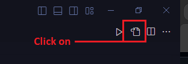

# My-VS-Code-Configuration-Preferences

Hi Here you will have access to my basic Vs Code settings, such as themes, fonts, terminal execution settings and much more...

<h2>HOW TO USAGE</H2>
For beginners who still don't know how to improve their code, here's a very quick tutorial.

<ol>
  <li> open your VS Code, and click on the gear, the tab that will open click on settings.  </li>
  <li>A layout will open, you can see the following icon in the upper right corner.</li>
  

  
  

  <li> Click on this icon and it will open a file in .json format </li>
  <li> If you want to change the settings, delete the contents of your file</li>
  <li> Now go to the .json files in my repository, copy and paste it into the .json of your VS Code. and press ctrl+s to save</li>
  <li> Reload your vscode</li>
</ol>
